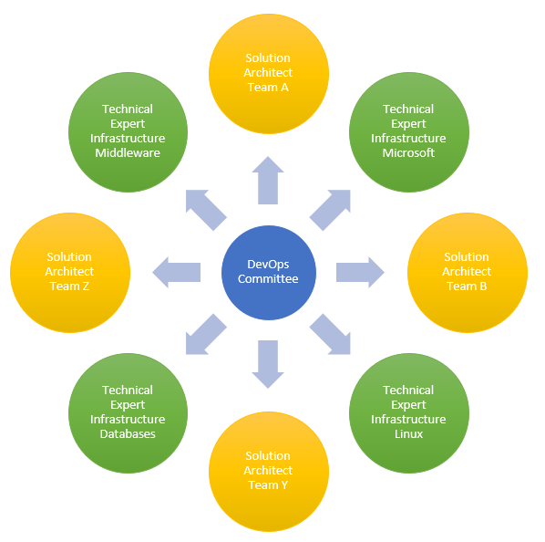

Enterprise architects should support the initiative and define high levels rules that all teams must follow. These rules will allow to provide same behaviors and implementation styles accross technologies and teams.

  

    Table of contents
  

  {: .text-delta }
1. TOC
{:toc}

## DevOps specific organization
{: .text-blue-300 }

We need to define an organization to support DevOps deployment and strategy. The main componenrt of this organization is to have a committee with the followings purpose :

* Define a clear goal of DevOps deployment
* Identify teams' needs and issues
* Define rules and best practices
* Report to CTO and domain's heads
* Ensure communication to all IT

### Committee members
{: .text-blue-200 }

The committee's legitimacy must be natural based on members experiences in the development, deployment and infrastructure :

* Enterprise architect or members of the enterprise architecture team
* Solution architects in the main developoment technologies used by the enterprise
* Infrastructure Experts

{: .important-title }
> Workload estimation
>
> To be able to realize their own tasks inside the committee and contribute to topics, each member should schedule **5 Man days / Months**
>
> It is important that members will be free to work for the committee.

### High level rules scope
{: .text-blue-200 }

### High level rules scope
{: .text-blue-200 }

* [Artifacts Management](./artifacts_management.md)

## Communication tools
{: .text-blue-300 }

## Development best practices
{: .text-blue-300 }

* All teams follow development best practices defined at enterprise level

  * Each team has a Solution's architect whom is the main contact point with enterprise's architects

* Best practices are different by technologies

* All development languages are not supported in the enterprise

  Usage of language inside the enterprise needs to be validated by architecture:

    * Popularity: Capacity to find developers in the local environment, third party packages available
    * Local expertise: Internal enterprise's developers knowledge
    * Productivity: Productivity ratio versus existing languages
    * Cost: Development IDE cost, additional licenses
    * Best practices definition
    * Continuous Integration implementation
    * Security: Third party components can be scanned for vulnerabilities
    * Package management

* Third party components (packages) are limited

  The number of packages grows exponentially with multiplication of components. Usage of new component must follow strict rules

