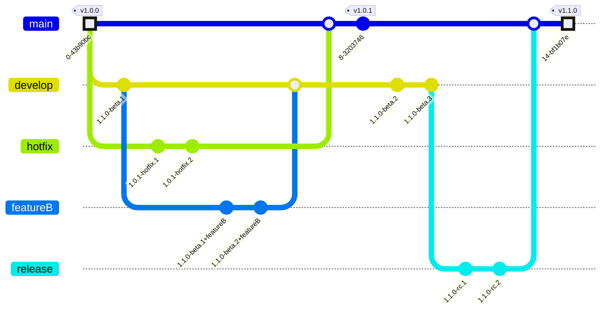

## Versioning applied to Git branching model

```mermaid
%%{init: { 'logLevel': 'debug', 'theme': 'default' } }%%
      gitGraph
        commit type:HIGHLIGHT tag: "v1.0.0"
        branch develop
        commit id: "1.1.0-beta.1"
        checkout main
        branch hotfix
        commit id: "1.0.1-hotfix.1"
        commit id: "1.0.1-hotfix.2"
        checkout develop
        branch featureB
        commit id: "1.1.0-beta.1+featureB"
        commit id: "1.1.0-beta.2+featureB"
        checkout develop
        merge featureB
        checkout main
        merge hotfix
        commit tag: "v1.0.1"
        checkout develop
        commit id: "1.1.0-beta.2"
        commit id: "1.1.0-beta.3"
        branch release
        commit id: "1.1.0-rc.1"
        commit id: "1.1.0-rc.2"
        checkout main
        merge release
        commit type:HIGHLIGHT tag: "v1.1.0"
```